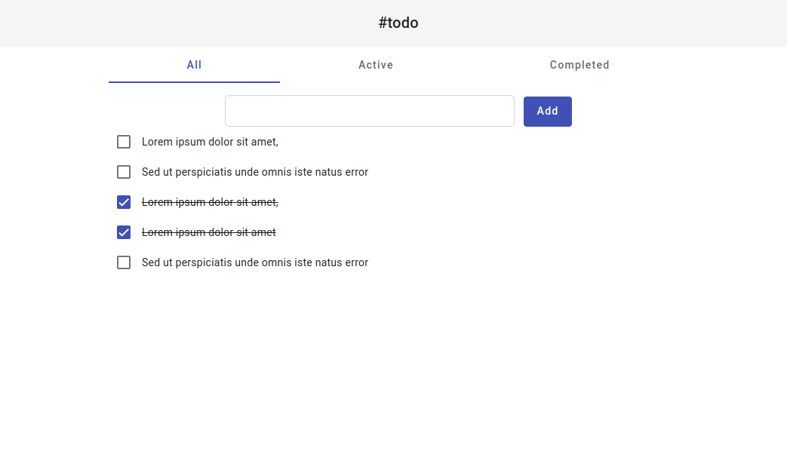

<!-- Please update value in the {}  -->

<h1 align="center">Task Tracker</h1>

<div align="center">
   Solution for a challenge from  <a href="http://devchallenges.io" target="_blank">Devchallenges.io</a>.
</div>

<div align="center">
  <h3>
    <a href="https://ng-todo-kappa.vercel.app/">
      Demo
    </a>
    <span> | </span>
    <a href="https://github.com/qurriahSam/ng-todo">
      Solution
    </a>
    <span> | </span>
    <a href="https://devchallenges.io/challenges/hH6PbOHBdPm6otzw2De5">
      Challenge
    </a>
  </h3>
</div>

<!-- TABLE OF CONTENTS -->

## Table of Contents

- [Overview](#overview)
  - [Built With](#built-with)
- [Features](#features)
- [How to use](#how-to-use)
- [Contact](#contact)

<!-- OVERVIEW -->

## Overview



ngToDo app is a simple and efficient to-do list manager designed to help you stay organized and productive, it allows you to easily add new tasks, mark them as complete, and toggle between different viewing modes.
One of the key features of the app is its ability to store data locally using local storage. This means that even if you refresh the page or close the browser, your task progress will be saved, allowing you to seamlessly continue where you left off.

### Built With

<!-- This section should list any major frameworks that you built your project using. Here are a few examples.-->

- [Angular](https://angular.io)
- [Angular-Material](https://material.angular.io)
- [Tailwind](https://tailwindcss.com/)
- [Material-Icons](https://fonts.google.com/)

## Features

<!-- List the features of your application or follow the template. Don't share the figma file here :) -->

This application/site was created as a submission to a [DevChallenges](https://devchallenges.io/challenges) challenge. The [challenge](https://devchallenges.io/challenges/3JFYedSOZqAxYuOCNmYD) was to build an application to complete the given user stories.

## How To Use

<!-- Example: -->

To clone and run this application, you'll need [Git](https://git-scm.com) and [Node.js](https://nodejs.org/en/download/) (which comes with [npm](http://npmjs.com)) installed on your computer. From your command line:

```bash
# Clone this repository
$ git clone https://github.com/qurriahSam/ng-todo

# Install dependencies
$ npm install

# Run the app
$ ng serve
```

## Contact

- LinkedIn [Sam Kuria](https://www.linkedin.com/in/sam-kuria/)
